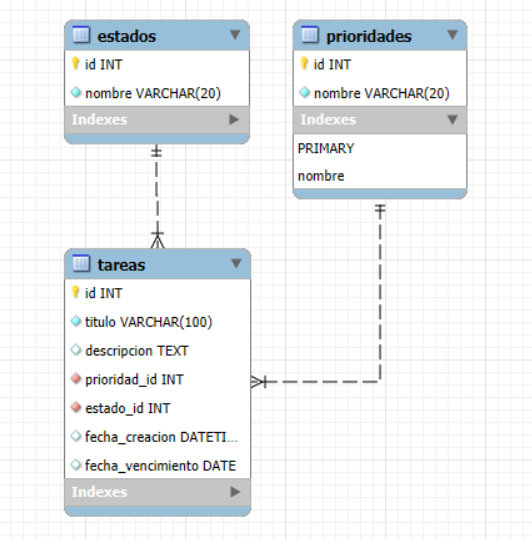

# Gestor de tareas con react + flask

Aplicación realizada con react, tailwindcss y Shadcn UI para el frontend, flask para el backend junto a una base de datos en mysql.

# Requisitos

*   Node.js
*   Python
*   Servidor MySQL instalado

# Diagrama de la base de datos


# Despliegue

1.  Ejecutar el script de en mysql para crear la base de datos.

2.  Configurar el backend
    *   Navegar al directorio del backend (ej. `cd backend/`).
    *   **Flask recomienda crear y activar un entorno virtual:**
        ```bash
        python3 -m venv .venv
        # En Windows:
        .venv\Scripts\activate
        # En macOS/Linux:
        source .venv/bin/activate
        ```
    *   **Instala las dependencias:**
        ```bash
        pip install -r requirements.txt
        ```
    *   **Crea el archivo `.env`** en la raíz del directorio del backend y configúralo con tus credenciales de la base:
        ```dotenv
        # backend/.env
        DATABASE_URL='mysql+mysqlconnector://<usuario>:<contraseña>@<host>:<puerto>/<nombre_db>'
        SECRET_KEY='<una_clave_secreta>'
        ```
    *   **Corre Flask**
        ```bash
        flask run
        ```

3.  **Inicializa el servidor para el frontend**
    *   Navega al directorio del frontend con otro terminal (ej. `cd ../frontend/`).
    *   **Instala las dependencias:**
        ```bash
        npm install
        ```
    *   **Crea el archivo `.env`** en la raíz del directorio del frontend y apunta a la URL de tu backend:
        ```dotenv
        VITE_API_BASE_URL=http://127.0.0.1:5000
        ```
    *   **Iniciar el Frontend:**
        * Ejecuta el servidor de desarrollo de Vite en la raíz del frontend:
            ```bash
            npm run dev
            ```

Con esto la aplicación ya debería de estar corriendo :)